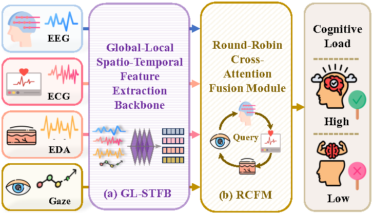

# AMPF-Net: Attention-Guided Multimodal Physiological Signals Fusion for Driver Cognitive Workload Recognition

<div align="center">
  
</div>

## Introduction

AMPF-Net is an attention-guided multimodal physiological fusion network that integrates EEG, ECG, EDA, and gaze signals for end-to-end driver cognitive workload recognition, leveraging a global-local spatio-temporal feature backbone (GL-STFB) and round-robin cross-attention fusion (RCFM) to achieve state-of-the-art performance.

## Environment Setup

### System Requirements

- Python 3.11+ 
- CUDA 11.0+ (optional, for GPU acceleration)
- 16GB+ RAM (recommended)

### Installation Steps

1. **Clone the repository**

```bash
git clone https://github.com/Wenzhuo-Liu/AMPF-Net
cd AMPF-Net
```

2. **Create a virtual environment**

```bash
conda create -n AMPF python=3.12 -y
conda activate AMPF
```

3. **Install dependencies**

```bash
pip install -r requirements.txt
```

## Dataset

This project uses the **CL-Drive** dataset for multimodal driver state analysis.
The repository includes a preprocessed CL-Drive package: `CL-Drive(preprocessed).zip`.

- Dataset page: https://borealisdata.ca/dataset.xhtml?persistentId=doi:10.5683/SP3/JJ2YZZ

By default, data paths are configured in `cl_drive_dataset_build.py` under:

```python
BASE_PATH = Path('./CL-Drive(preprocessed)')
```

Place the extracted CL-Drive preprocessed folder in the project root (or update `BASE_PATH` accordingly) before running preprocessing/training.

## Data Preprocessing

Run `python cl_drive_dataset_build.py` to preprocess the four modalities and save the processed bundle to `./multimodal_dataset`.

```bash
python cl_drive_dataset_build.py
```

## Usage

### Training (10-Fold Cross-Validation)

After preprocessing, run:

```bash
python main.py
```

`python main.py` loads the processed data, runs 10-fold cross-validation training/evaluation, and saves outputs to `./results`.

## Project Structure

```text
.
├── cl_drive_dataset_build.py   # CL-Drive preprocessing and bundle export
├── gl_stfb.py                  # GL-STFB backbone (LMSM + CSIM + GTM)
├── rcfm.py                     # AMPF-Net modal encoders and fusion network
└── main.py                     # 10-fold CV training/evaluation pipeline
```

